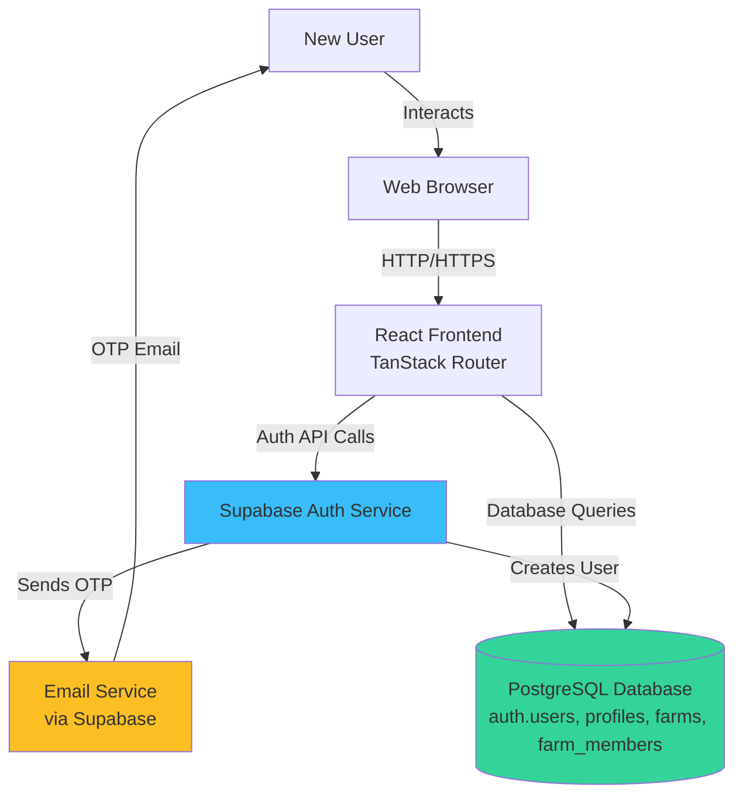
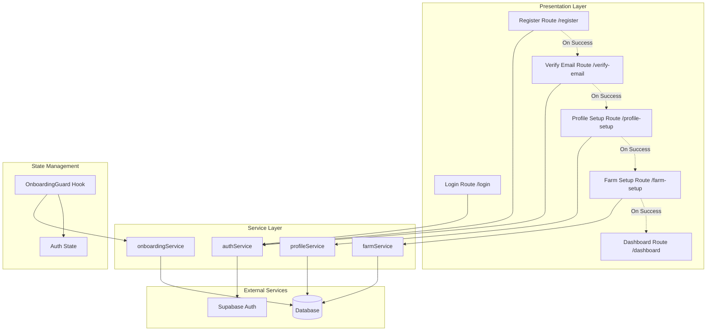
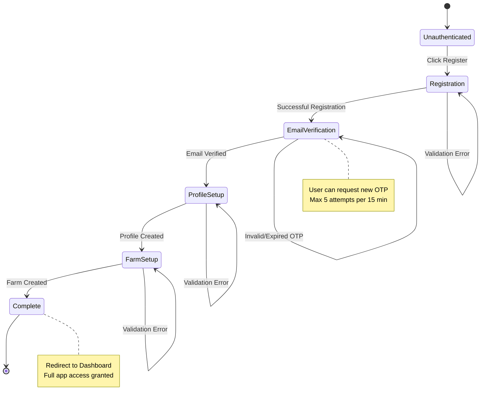
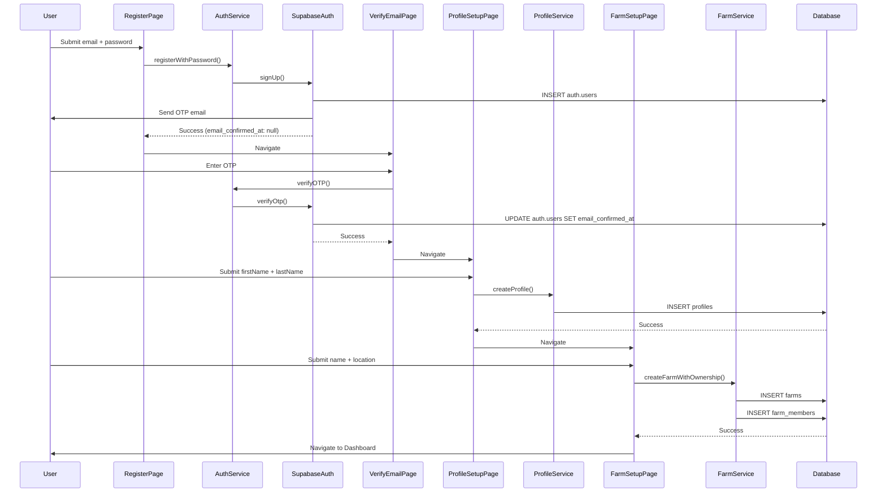

# Technical Design Document: User Registration and Onboarding

## Overview

This document presents the technical design for a sequential user registration and onboarding system that guides new users through account creation, email verification via OTP, profile completion, and initial farm setup. The system leverages Supabase Auth for authentication, integrates with the existing database schema, and implements a state-driven flow to ensure users complete all necessary onboarding steps before accessing the main application.

### Goals

1. **Secure Registration**: Implement email/password registration with validation and secure password storage
2. **Email Verification**: Verify user email ownership through OTP (One-Time Password) delivery and validation
3. **Profile Completion**: Collect and store user profile information (full name) in the profiles table
4. **Farm Initialization**: Guide users through creating their first farm with automatic owner assignment
5. **State Management**: Track onboarding progress and enable resumption from incomplete steps
6. **User Experience**: Provide clear navigation, validation feedback, and error handling throughout the flow

### Architecture Approach

The system follows a **layered architecture** with clear separation between:

- **Presentation Layer**: React components using TanStack Router for navigation
- **Service Layer**: TypeScript services encapsulating business logic and API calls
- **Data Layer**: Supabase Auth for authentication and PostgreSQL for user/farm data
- **Validation Layer**: Zod schemas for input validation

The onboarding flow is implemented as a **finite state machine** where each step:

- Has entry conditions (prerequisites from previous steps)
- Performs validation and data persistence
- Determines the next step upon successful completion
- Allows resumption from partial completion states

## Architecture

### System Context



### Component Architecture



### Onboarding State Flow



## Components and Interfaces

### Service Layer Components

#### 1. authService (Extended)

**Purpose**: Handle user registration, email verification, and authentication operations.

**Interface**:

```typescript
interface AuthService {
  // Existing methods
  loginWithPassword(email: string, password: string): Promise<AuthResponse>;
  logout(): Promise<void>;
  getCurrentUser(): Promise<User | null>;
  getSession(): Promise<Session | null>;
  onAuthStateChange(callback: AuthCallback): Subscription;

  // New methods for registration
  registerWithPassword(email: string, password: string): Promise<AuthResponse>;
  verifyOTP(email: string, token: string): Promise<AuthResponse>;
  resendOTP(email: string): Promise<void>;
}
```

**Implementation Details**:

- `registerWithPassword()`: Calls `supabase.auth.signUp()` with email/password
- Supabase automatically sends OTP email upon signup
- Returns user object with `email_confirmed_at: null` until verified
- `verifyOTP()`: Calls `supabase.auth.verifyOtp()` with type 'email'
- `resendOTP()`: Calls `supabase.auth.resend()` to generate new OTP

#### 2. onboardingService (New)

**Purpose**: Determine the current onboarding state and next required step for a user.

**Interface**:

```typescript
type OnboardingStep =
  | "REGISTRATION"
  | "EMAIL_VERIFICATION"
  | "PROFILE_SETUP"
  | "FARM_SETUP"
  | "COMPLETE";

interface OnboardingStatus {
  currentStep: OnboardingStep;
  isComplete: boolean;
  nextRoute: string;
}

interface OnboardingService {
  getOnboardingStatus(userId: string): Promise<OnboardingStatus>;
  checkEmailVerified(userId: string): Promise<boolean>;
  checkProfileExists(userId: string): Promise<boolean>;
  checkFarmExists(userId: string): Promise<boolean>;
}
```

**Implementation Logic**:

```typescript
async function getOnboardingStatus(userId: string): Promise<OnboardingStatus> {
  const user = await supabase.auth.getUser();
  const emailVerified = user.data.user?.email_confirmed_at !== null;

  if (!emailVerified) {
    return { currentStep: "EMAIL_VERIFICATION", isComplete: false, nextRoute: "/verify-email" };
  }

  const { data: profile } = await supabase.from("profiles").select("id").eq("id", userId).single();

  if (!profile) {
    return { currentStep: "PROFILE_SETUP", isComplete: false, nextRoute: "/profile-setup" };
  }

  const { data: farm } = await supabase.from("farms").select("id").eq("owner_id", userId).single();

  if (!farm) {
    return { currentStep: "FARM_SETUP", isComplete: false, nextRoute: "/farm-setup" };
  }

  return { currentStep: "COMPLETE", isComplete: true, nextRoute: "/dashboard" };
}
```

#### 3. profileService (New)

**Purpose**: Create and manage user profiles.

**Interface**:

```typescript
interface ProfileInput {
  firstName: string;
  lastName: string;
}

interface ProfileService {
  createProfile(userId: string, input: ProfileInput): Promise<Profile>;
  getProfile(userId: string): Promise<Profile | null>;
}
```

**Implementation Details**:

- Concatenates `firstName` and `lastName` with space separator for `full_name`
- Retrieves email from auth.users via `supabase.auth.getUser()`
- Trims whitespace from input fields
- Sets `created_at` and `updated_at` to current timestamp

#### 4. farmService (Extended)

**Purpose**: Create farms and manage farm memberships.

**Interface**:

```typescript
interface FarmInput {
  name: string;
  location?: string;
}

interface FarmService {
  // New methods
  createFarmWithOwnership(userId: string, input: FarmInput): Promise<Farm>;

  // Existing methods...
}
```

**Implementation Details**:

```typescript
async function createFarmWithOwnership(userId: string, input: FarmInput): Promise<Farm> {
  // 1. Create farm record
  const { data: farm, error: farmError } = await supabase
    .from("farms")
    .insert({
      name: input.name.trim(),
      location: input.location?.trim() || null,
      owner_id: userId,
    })
    .select()
    .single();

  if (farmError) throw farmError;

  // 2. Create farm_members record for ownership
  const { error: memberError } = await supabase.from("farm_members").insert({
    farm_id: farm.id,
    user_id: userId,
    role: "owner",
    status: "active",
    created_by: userId,
  });

  if (memberError) throw memberError;

  return farm;
}
```

### Presentation Layer Components

#### 1. RegisterRoute (/register)

**Purpose**: Display registration form and handle user signup.

**Key Features**:

- Email input with RFC 5322 format validation
- Password input with confirmation field
- Minimum 8 character password requirement
- Client-side validation before submission
- Error display for validation failures
- Link to login page for existing users

**Component Structure**:

```typescript
function RegisterPage() {
  const navigate = useNavigate();
  const [formData, setFormData] = useState({ email: '', password: '', confirmPassword: '' });
  const [errors, setErrors] = useState<Record<string, string>>({});
  const [loading, setLoading] = useState(false);

  const handleSubmit = async (e: FormEvent) => {
    e.preventDefault();
    const validationErrors = validateRegistrationForm(formData);
    if (Object.keys(validationErrors).length > 0) {
      setErrors(validationErrors);
      return;
    }

    setLoading(true);
    try {
      await authService.registerWithPassword(formData.email, formData.password);
      toast.success('Registration successful! Check your email for verification code.');
      navigate({ to: '/verify-email', search: { email: formData.email } });
    } catch (err) {
      setErrors({ submit: err.message });
    } finally {
      setLoading(false);
    }
  };

  return (
    <RegistrationForm
      formData={formData}
      errors={errors}
      loading={loading}
      onChange={setFormData}
      onSubmit={handleSubmit}
    />
  );
}
```

#### 2. VerifyEmailRoute (/verify-email)

**Purpose**: Display OTP input and handle email verification.

**Key Features**:

- 6-digit OTP input component (using input-otp library)
- Auto-submit when 6 digits entered
- "Resend OTP" button with cooldown timer
- Attempt counter (max 5 attempts per 15 minutes)
- Lockout message when attempts exceeded
- Clear error messages for invalid/expired OTP

**Component Structure**:

```typescript
function VerifyEmailPage() {
  const navigate = useNavigate();
  const { email } = Route.useSearch();
  const [otp, setOtp] = useState('');
  const [attempts, setAttempts] = useState(0);
  const [locked, setLocked] = useState(false);
  const [canResend, setCanResend] = useState(true);
  const [countdown, setCountdown] = useState(0);

  useEffect(() => {
    if (otp.length === 6) {
      handleVerify();
    }
  }, [otp]);

  const handleVerify = async () => {
    if (attempts >= 5) {
      setLocked(true);
      toast.error('Too many attempts. Please wait 15 minutes.');
      return;
    }

    try {
      await authService.verifyOTP(email, otp);
      toast.success('Email verified successfully!');
      navigate({ to: '/profile-setup' });
    } catch (err) {
      setAttempts(prev => prev + 1);
      toast.error('Invalid or expired OTP. Please try again.');
      setOtp('');
    }
  };

  const handleResend = async () => {
    await authService.resendOTP(email);
    toast.success('New verification code sent!');
    setCanResend(false);
    setCountdown(60);
    // Start countdown timer...
  };

  return (
    <VerifyEmailForm
      otp={otp}
      locked={locked}
      canResend={canResend}
      countdown={countdown}
      onChange={setOtp}
      onResend={handleResend}
    />
  );
}
```

#### 3. ProfileSetupRoute (/profile-setup)

**Purpose**: Collect user's first and last name.

**Key Features**:

- First name input (required, non-empty after trim)
- Last name input (required, non-empty after trim)
- Client-side validation
- Auto-trim whitespace
- Progress indicator showing step 1 of 2

**Component Structure**:

```typescript
function ProfileSetupPage() {
  const navigate = useNavigate();
  const [formData, setFormData] = useState({ firstName: '', lastName: '' });
  const [errors, setErrors] = useState<Record<string, string>>({});
  const [loading, setLoading] = useState(false);

  const handleSubmit = async (e: FormEvent) => {
    e.preventDefault();
    const validationErrors = validateProfileForm(formData);
    if (Object.keys(validationErrors).length > 0) {
      setErrors(validationErrors);
      return;
    }

    setLoading(true);
    try {
      const user = await authService.getCurrentUser();
      await profileService.createProfile(user!.id, formData);
      toast.success('Profile created!');
      navigate({ to: '/farm-setup' });
    } catch (err) {
      setErrors({ submit: err.message });
    } finally {
      setLoading(false);
    }
  };

  return (
    <ProfileSetupForm
      formData={formData}
      errors={errors}
      loading={loading}
      onChange={setFormData}
      onSubmit={handleSubmit}
    />
  );
}
```

#### 4. FarmSetupRoute (/farm-setup)

**Purpose**: Create user's first farm.

**Key Features**:

- Farm name input (required, non-empty after trim)
- Location input (optional)
- Client-side validation
- Auto-trim whitespace
- Progress indicator showing step 2 of 2

**Component Structure**:

```typescript
function FarmSetupPage() {
  const navigate = useNavigate();
  const [formData, setFormData] = useState({ name: '', location: '' });
  const [errors, setErrors] = useState<Record<string, string>>({});
  const [loading, setLoading] = useState(false);

  const handleSubmit = async (e: FormEvent) => {
    e.preventDefault();
    const validationErrors = validateFarmForm(formData);
    if (Object.keys(validationErrors).length > 0) {
      setErrors(validationErrors);
      return;
    }

    setLoading(true);
    try {
      const user = await authService.getCurrentUser();
      await farmService.createFarmWithOwnership(user!.id, {
        name: formData.name,
        location: formData.location || undefined,
      });
      toast.success('Farm created! Welcome to PenWise Path.');
      navigate({ to: '/dashboard' });
    } catch (err) {
      setErrors({ submit: err.message });
    } finally {
      setLoading(false);
    }
  };

  return (
    <FarmSetupForm
      formData={formData}
      errors={errors}
      loading={loading}
      onChange={setFormData}
      onSubmit={handleSubmit}
    />
  );
}
```

#### 5. useOnboardingGuard Hook

**Purpose**: Protect routes and redirect users to appropriate onboarding step.

**Usage**:

```typescript
function useOnboardingGuard() {
  const navigate = useNavigate();
  const [loading, setLoading] = useState(true);
  const [status, setStatus] = useState<OnboardingStatus | null>(null);

  useEffect(() => {
    const checkOnboarding = async () => {
      const user = await authService.getCurrentUser();
      if (!user) {
        navigate({ to: "/login" });
        return;
      }

      const onboardingStatus = await onboardingService.getOnboardingStatus(user.id);
      setStatus(onboardingStatus);

      if (!onboardingStatus.isComplete) {
        navigate({ to: onboardingStatus.nextRoute });
      }

      setLoading(false);
    };

    checkOnboarding();
  }, [navigate]);

  return { loading, status };
}
```

**Integration with ProtectedRoute**:

```typescript
function ProtectedRoute({ children }: { children: ReactNode }) {
  const { loading, status } = useOnboardingGuard();

  if (loading) {
    return <LoadingSpinner />;
  }

  if (!status?.isComplete) {
    return null; // useOnboardingGuard handles redirect
  }

  return <>{children}</>;
}
```

## Data Models

### Database Schema Interactions

The onboarding system interacts with the following tables:

#### 1. auth.users (Supabase Auth)

**Managed by**: Supabase Auth Service

**Relevant Fields**:

```sql
TABLE auth.users (
  id uuid PRIMARY KEY,
  email text UNIQUE NOT NULL,
  encrypted_password text NOT NULL,
  email_confirmed_at timestamp with time zone,
  created_at timestamp with time zone DEFAULT now(),
  updated_at timestamp with time zone DEFAULT now()
)
```

**Operations**:

- Created during `authService.registerWithPassword()`
- Updated (`email_confirmed_at`) during `authService.verifyOTP()`

#### 2. profiles

**Purpose**: Store user profile information

**Schema**:

```sql
TABLE profiles (
  id uuid PRIMARY KEY REFERENCES auth.users(id),
  full_name text,
  email text NOT NULL,
  last_active_at timestamp with time zone,
  created_at timestamp with time zone DEFAULT now(),
  updated_at timestamp with time zone DEFAULT now()
)
```

**Operations**:

```typescript
// Create profile
INSERT INTO profiles (id, full_name, email, created_at, updated_at)
VALUES ($userId, $fullName, $email, now(), now())
```

**Constraints**:

- `id` must reference existing `auth.users.id`
- `email` populated from `auth.users.email`
- `full_name` derived from `firstName + ' ' + lastName`

#### 3. farms

**Purpose**: Store farm entities

**Schema**:

```sql
TABLE farms (
  id uuid PRIMARY KEY DEFAULT gen_random_uuid(),
  name text NOT NULL,
  location text,
  owner_id uuid NOT NULL REFERENCES auth.users(id),
  created_at timestamp with time zone DEFAULT now(),
  updated_at timestamp with time zone DEFAULT now()
)
```

**Operations**:

```typescript
// Create farm
INSERT INTO farms (name, location, owner_id, created_at, updated_at)
VALUES ($name, $location, $userId, now(), now())
RETURNING id
```

#### 4. farm_members

**Purpose**: Link users to farms with roles

**Schema**:

```sql
TABLE farm_members (
  id uuid PRIMARY KEY DEFAULT gen_random_uuid(),
  farm_id uuid NOT NULL REFERENCES farms(id),
  user_id uuid NOT NULL REFERENCES auth.users(id),
  role text NOT NULL DEFAULT 'worker' CHECK (role IN ('owner', 'manager', 'worker')),
  status text NOT NULL DEFAULT 'active' CHECK (status IN ('active', 'inactive')),
  created_by uuid REFERENCES auth.users(id),
  created_at timestamp with time zone DEFAULT now(),
  updated_at timestamp with time zone DEFAULT now()
)
```

**Operations**:

```typescript
// Create farm membership
INSERT INTO farm_members (farm_id, user_id, role, status, created_by, created_at, updated_at)
VALUES ($farmId, $userId, 'owner', 'active', $userId, now(), now())
```

### Data Flow Diagram



### TypeScript Type Definitions

```typescript
// Auth types
interface RegistrationInput {
  email: string;
  password: string;
  confirmPassword: string;
}

interface OTPVerificationInput {
  email: string;
  token: string;
}

// Profile types
interface ProfileInput {
  firstName: string;
  lastName: string;
}

interface Profile {
  id: string;
  full_name: string;
  email: string;
  created_at: string;
  updated_at: string;
}

// Farm types
interface FarmInput {
  name: string;
  location?: string;
}

interface Farm {
  id: string;
  name: string;
  location: string | null;
  owner_id: string;
  created_at: string;
  updated_at: string;
}

interface FarmMembership {
  id: string;
  farm_id: string;
  user_id: string;
  role: "owner" | "manager" | "worker";
  status: "active" | "inactive";
  created_by: string;
  created_at: string;
  updated_at: string;
}

// Onboarding types
type OnboardingStep =
  | "REGISTRATION"
  | "EMAIL_VERIFICATION"
  | "PROFILE_SETUP"
  | "FARM_SETUP"
  | "COMPLETE";

interface OnboardingStatus {
  currentStep: OnboardingStep;
  isComplete: boolean;
  nextRoute: string;
}
```

## Validation Layer

### Zod Schemas

```typescript
import { z } from "zod";

// Registration validation
export const registrationSchema = z
  .object({
    email: z.string().min(1, "Email is required").email("Invalid email format"),
    password: z.string().min(8, "Password must be at least 8 characters"),
    confirmPassword: z.string(),
  })
  .refine((data) => data.password === data.confirmPassword, {
    message: "Passwords don't match",
    path: ["confirmPassword"],
  });

// OTP validation
export const otpSchema = z.object({
  email: z.string().email(),
  token: z
    .string()
    .length(6, "OTP must be 6 digits")
    .regex(/^\d{6}$/, "OTP must contain only numbers"),
});

// Profile validation
export const profileSchema = z.object({
  firstName: z
    .string()
    .min(1, "First name is required")
    .transform((s) => s.trim())
    .refine((s) => s.length > 0, "First name cannot be empty"),
  lastName: z
    .string()
    .min(1, "Last name is required")
    .transform((s) => s.trim())
    .refine((s) => s.length > 0, "Last name cannot be empty"),
});

// Farm validation
export const farmSchema = z.object({
  name: z
    .string()
    .min(1, "Farm name is required")
    .transform((s) => s.trim())
    .refine((s) => s.length > 0, "Farm name cannot be empty"),
  location: z
    .string()
    .transform((s) => s.trim())
    .optional(),
});
```

### Validation Usage

```typescript
function validateRegistrationForm(input: RegistrationInput): Record<string, string> {
  try {
    registrationSchema.parse(input);
    return {};
  } catch (err) {
    if (err instanceof z.ZodError) {
      return err.errors.reduce(
        (acc, error) => {
          acc[error.path[0]] = error.message;
          return acc;
        },
        {} as Record<string, string>,
      );
    }
    return { general: "Validation failed" };
  }
}
```

## Correctness Properties

_A property is a characteristic or behavior that should hold true across all valid executions of a system—essentially, a formal statement about what the system should do. Properties serve as the bridge between human-readable specifications and machine-verifiable correctness guarantees._

### Reflection and Redundancy Analysis

After analyzing the acceptance criteria, several redundancies were identified:

1. **Timestamp Properties**: Requirements 3.6, 4.6, and 5.7 all test timestamp setting. These can be combined into a single property about record creation timestamps.

2. **Trimming Properties**: Requirements 3.9 and 4.8 both test whitespace trimming. These can be combined into a single property about input sanitization.

3. **Referential Integrity Properties**: Requirements 3.3, 4.3, 5.2, 5.3, and 5.6 all test foreign key relationships. These can be grouped into properties about referential integrity during onboarding.

4. **Empty Input Validation**: Requirements 3.7, 3.8, and 4.7 all test rejection of empty inputs. These follow the same pattern and can be combined.

5. **Farm Ownership Properties**: Requirements 5.2, 5.3, 5.4, 5.5, and 5.6 test various aspects of farm membership creation. These can be combined into a single comprehensive property about automatic ownership assignment.

The following properties represent the unique validation concerns after removing redundancy:

### Property 1: Registration Creates Auth User

_For any_ valid email and password pair where the email does not already exist, calling `registerWithPassword()` SHALL create an `auth.users` record with the provided email and return a user identifier.

**Validates: Requirements 1.1, 1.7**

### Property 2: Duplicate Email Registration Rejection

_For any_ email that already exists in `auth.users`, attempting to register with that email SHALL be rejected with an error indicating the email is already registered.

**Validates: Requirements 1.2**

### Property 3: Password Mismatch Rejection

_For any_ pair of non-matching passwords, attempting to register SHALL be rejected with an error indicating the passwords do not match.

**Validates: Requirements 1.3**

### Property 4: Invalid Email Format Rejection

_For any_ string that does not conform to RFC 5322 email format, attempting to register SHALL be rejected with an error indicating invalid email format.

**Validates: Requirements 1.4**

### Property 5: OTP Verification Success

_For any_ valid OTP submitted before expiration, calling `verifyOTP()` SHALL mark the email as verified by setting `email_confirmed_at` to a non-null timestamp.

**Validates: Requirements 2.4**

### Property 6: Invalid OTP Rejection

_For any_ incorrect OTP code, calling `verifyOTP()` SHALL be rejected with an error indicating the OTP is invalid.

**Validates: Requirements 2.6**

### Property 7: OTP Invalidation on Resend

_For any_ user with an existing OTP, calling `resendOTP()` SHALL invalidate the previous OTP such that the old OTP is rejected by `verifyOTP()`.

**Validates: Requirements 2.9**

### Property 8: Profile Creation with Full Name Concatenation

_For any_ verified user and valid `firstName` and `lastName`, calling `createProfile()` SHALL create a `profiles` record where `full_name` equals `firstName + ' ' + lastName` (with space separator).

**Validates: Requirements 3.2, 3.4**

### Property 9: Profile Referential Integrity

_For any_ created profile, the `profile.id` SHALL equal the authenticated user's `id`, and `profile.email` SHALL equal the user's verified email from `auth.users`.

**Validates: Requirements 3.3, 3.5**

### Property 10: Empty Name Rejection

_For any_ string consisting entirely of whitespace characters (including empty string), attempting to create a profile with that string as `firstName` or `lastName` SHALL be rejected with an appropriate error message.

**Validates: Requirements 3.7, 3.8**

### Property 11: Input Whitespace Trimming

_For any_ input string with leading or trailing whitespace used in profile creation or farm creation, the stored value SHALL have leading and trailing whitespace removed.

**Validates: Requirements 3.9, 4.8**

### Property 12: Farm Creation with Owner Assignment

_For any_ valid farm name and user ID, calling `createFarmWithOwnership()` SHALL create a `farms` record AND a `farm_members` record where `farm_members.farm_id` equals the new `farms.id`, `farm_members.user_id` equals the provided user ID, `farm_members.role` equals `'owner'`, and `farm_members.status` equals `'active'`.

**Validates: Requirements 4.2, 5.1, 5.2, 5.3, 5.4, 5.5**

### Property 13: Farm Owner Referential Integrity

_For any_ created farm, `farm.owner_id` SHALL equal the authenticated user's ID, and `farm_members.created_by` SHALL equal the authenticated user's ID.

**Validates: Requirements 4.3, 5.6**

### Property 14: Optional Location Handling

_For any_ farm creation where location is provided (non-empty string), `farm.location` SHALL equal the provided location; for any farm creation where location is not provided (empty, null, or undefined), `farm.location` SHALL be NULL.

**Validates: Requirements 4.4, 4.5**

### Property 15: Empty Farm Name Rejection

_For any_ string consisting entirely of whitespace characters (including empty string), attempting to create a farm with that string as the farm name SHALL be rejected with an appropriate error message.

**Validates: Requirements 4.7**

### Property 16: Record Timestamp Setting

_For any_ record created during onboarding (profiles, farms, farm_members), the `created_at` and `updated_at` fields SHALL be set to timestamps within an acceptable time window (e.g., within 5 seconds of creation).

**Validates: Requirements 3.6, 4.6, 5.7**

### Property 17: Onboarding Guard Redirection

_For any_ authenticated user in an incomplete onboarding state (missing profile or farm), attempting to access protected application routes SHALL redirect the user to the next required onboarding step as determined by `getOnboardingStatus()`.

**Validates: Requirements 6.7, 6.8**

### Property 18: Onboarding Status Determination

_For any_ user, calling `getOnboardingStatus()` SHALL return the correct `OnboardingStep` based on: (1) if `email_confirmed_at` is null, return `EMAIL_VERIFICATION`; (2) if no profile exists, return `PROFILE_SETUP`; (3) if no farm exists, return `FARM_SETUP`; (4) otherwise return `COMPLETE`.

**Validates: Requirements 7.4**

### Property 19: Error State Clearing on Resubmission

_For any_ form with validation errors, correcting the invalid input and resubmitting SHALL clear the error state, such that no error messages from the previous submission are displayed.

**Validates: Requirements 8.6**

## Error Handling

### Error Categories

The onboarding system handles errors across multiple categories:

#### 1. Validation Errors

**Source**: Client-side Zod schema validation

**Handling Strategy**:

- Validate input before making API calls
- Display field-level error messages inline with form inputs
- Prevent form submission when validation fails
- Clear errors when user corrects input

**Examples**:

- Invalid email format
- Password too short
- Passwords don't match
- Empty required fields

**User Experience**:

```typescript
// Example error display
{errors.email && (
  <p className="text-sm text-red-500 mt-1">{errors.email}</p>
)}
```

#### 2. Authentication Errors

**Source**: Supabase Auth API

**Handling Strategy**:

- Catch errors from `authService` methods
- Display user-friendly error messages via toast notifications
- Provide actionable guidance (e.g., "Email already registered - try logging in")
- Log technical details for debugging

**Examples**:

- Email already exists (status 400)
- Invalid OTP (status 400)
- OTP expired (status 400)
- Too many attempts (status 429)

**Error Mapping**:

```typescript
function handleAuthError(error: any): string {
  if (error.message?.includes("already registered")) {
    return "This email is already registered. Please try logging in.";
  }
  if (error.message?.includes("invalid_grant")) {
    return "Invalid verification code. Please try again.";
  }
  if (error.message?.includes("expired")) {
    return "Verification code has expired. Please request a new one.";
  }
  return "An error occurred. Please try again.";
}
```

#### 3. Database Errors

**Source**: Supabase PostgreSQL operations

**Handling Strategy**:

- Catch errors from database operations
- Retry transient errors (network timeouts)
- Display generic error message to user
- Log detailed error for investigation

**Examples**:

- Foreign key constraint violation
- Network timeout
- Database unavailable
- Permission denied

**Retry Logic**:

```typescript
async function withRetry<T>(
  operation: () => Promise<T>,
  maxAttempts = 3,
  delayMs = 1000,
): Promise<T> {
  for (let attempt = 1; attempt <= maxAttempts; attempt++) {
    try {
      return await operation();
    } catch (error) {
      if (attempt === maxAttempts || !isRetryableError(error)) {
        throw error;
      }
      await new Promise((resolve) => setTimeout(resolve, delayMs * attempt));
    }
  }
  throw new Error("Max retry attempts exceeded");
}
```

#### 4. Network Errors

**Source**: HTTP request failures

**Handling Strategy**:

- Detect offline state
- Display connection error message
- Provide retry button
- Queue operations for retry when connection restored

**User Experience**:

```typescript
if (!navigator.onLine) {
  toast.error("No internet connection. Please check your network and try again.");
  return;
}
```

#### 5. Rate Limiting

**Source**: OTP verification attempts

**Handling Strategy**:

- Track failed OTP attempts in component state
- Lock verification form after 5 failed attempts
- Display lockout message with countdown timer
- Clear lockout after 15 minutes

**Implementation**:

```typescript
const [attempts, setAttempts] = useState(0);
const [lockedUntil, setLockedUntil] = useState<Date | null>(null);

const handleVerify = async () => {
  if (lockedUntil && new Date() < lockedUntil) {
    const remainingMinutes = Math.ceil((lockedUntil.getTime() - Date.now()) / 60000);
    toast.error(`Too many attempts. Try again in ${remainingMinutes} minutes.`);
    return;
  }

  try {
    await authService.verifyOTP(email, otp);
    // Success handling...
  } catch (error) {
    setAttempts((prev) => prev + 1);
    if (attempts + 1 >= 5) {
      const lockoutEnd = new Date(Date.now() + 15 * 60 * 1000);
      setLockedUntil(lockoutEnd);
      toast.error("Too many failed attempts. Locked for 15 minutes.");
    } else {
      toast.error("Invalid code. Please try again.");
    }
  }
};
```

### Error Logging

All errors are logged for debugging and monitoring:

```typescript
function logError(context: string, error: any, metadata?: Record<string, any>) {
  console.error(`[${context}]`, {
    message: error.message,
    stack: error.stack,
    timestamp: new Date().toISOString(),
    ...metadata,
  });

  // In production, send to error tracking service (e.g., Sentry)
  // errorTrackingService.captureException(error, { context, ...metadata });
}
```

### Graceful Degradation

When critical services are unavailable:

1. **Email Service Down**:
   - Display message: "Email service temporarily unavailable"
   - Provide alternative: Contact support with email address
   - Allow manual verification by admin

2. **Database Unavailable**:
   - Display maintenance message
   - Provide estimated restoration time
   - Offer status page link

3. **Authentication Service Down**:
   - Display authentication unavailable message
   - Prevent new registrations temporarily
   - Allow existing sessions to continue

## Testing Strategy

### Testing Approach

The onboarding system requires a **dual testing approach** combining unit tests for specific scenarios and property-based tests for comprehensive input coverage:

#### Unit Tests

Unit tests focus on:

- **Specific examples**: Concrete registration, verification, and farm creation scenarios
- **Navigation flow**: Verifying correct route transitions at each onboarding step
- **Edge cases**: Specific error conditions (5 failed OTP attempts, expired OTP)
- **Integration points**: Mocking Supabase responses and verifying correct handling

#### Property-Based Tests

Property-based tests focus on:

- **Universal properties**: Validation that holds across all valid inputs
- **Input variation**: Testing with randomly generated emails, names, passwords
- **Referential integrity**: Ensuring database relationships are always correct
- **Data transformation**: Verifying trimming, concatenation, and formatting logic

### Test Organization

```
src/features/auth/
├── services/
│   ├── authService.ts
│   ├── authService.test.ts (unit tests)
│   └── authService.properties.test.ts (property tests)
├── onboarding/
│   ├── services/
│   │   ├── onboardingService.ts
│   │   ├── onboardingService.test.ts
│   │   └── onboardingService.properties.test.ts
│   ├── components/
│   │   ├── RegisterPage.tsx
│   │   ├── RegisterPage.test.tsx
│   │   ├── VerifyEmailPage.tsx
│   │   └── VerifyEmailPage.test.tsx
│   └── hooks/
│       ├── useOnboardingGuard.ts
│       └── useOnboardingGuard.test.ts
src/features/profile/
├── services/
│   ├── profileService.ts
│   ├── profileService.test.ts
│   └── profileService.properties.test.ts
src/features/farm/
├── services/
│   ├── farmService.ts (extended)
│   ├── farmService.test.ts
│   └── farmService.properties.test.ts
```

### Property-Based Testing Configuration

**Library**: `fast-check` (property-based testing for TypeScript)

**Configuration**:

- Minimum **100 iterations** per property test
- Shrinking enabled to find minimal failing cases
- Timeout: 30 seconds per property test

**Example Property Test Structure**:

```typescript
import fc from "fast-check";

describe("Property: Registration Creates Auth User", () => {
  it("should create auth.users record for any valid email and password", async () => {
    // Feature: user-registration-onboarding, Property 1: Registration Creates Auth User
    await fc.assert(
      fc.asyncProperty(
        fc.emailAddress(), // Generate valid emails
        fc.string({ minLength: 8, maxLength: 50 }), // Generate valid passwords
        async (email, password) => {
          // Ensure email doesn't exist
          await cleanupUser(email);

          // Register user
          const result = await authService.registerWithPassword(email, password);

          // Verify auth.users record created
          expect(result.user).toBeDefined();
          expect(result.user.email).toBe(email);

          // Verify user ID returned
          expect(result.user.id).toBeTruthy();

          // Cleanup
          await cleanupUser(email);
        },
      ),
      { numRuns: 100 },
    );
  });
});
```

### Test Data Generators

Custom generators for domain-specific data:

```typescript
// Email generator
const validEmail = fc.emailAddress();

// Password generator (min 8 chars)
const validPassword = fc.string({ minLength: 8, maxLength: 50 });

// Name generator (non-empty, reasonable length)
const validName = fc.string({ minLength: 1, maxLength: 100 }).filter((s) => s.trim().length > 0);

// Whitespace-only string generator
const whitespaceOnlyString = fc
  .stringOf(fc.constantFrom(" ", "\t", "\n"))
  .filter((s) => s.length > 0 && s.trim().length === 0);

// Farm name generator
const validFarmName = fc
  .string({ minLength: 1, maxLength: 200 })
  .filter((s) => s.trim().length > 0);

// Optional location generator
const optionalLocation = fc.option(fc.string({ minLength: 1, maxLength: 200 }), { nil: undefined });
```

### Integration Testing

Integration tests verify the complete onboarding flow:

```typescript
describe("Complete Onboarding Flow Integration", () => {
  it("should guide user from registration through to dashboard", async () => {
    const testEmail = `test-${Date.now()}@example.com`;
    const testPassword = "SecurePass123";

    // Step 1: Register
    const { user } = await authService.registerWithPassword(testEmail, testPassword);
    expect(user.email).toBe(testEmail);
    expect(user.email_confirmed_at).toBeNull();

    // Step 2: Verify email (mock OTP)
    const mockOTP = "123456";
    await authService.verifyOTP(testEmail, mockOTP);
    const verifiedUser = await authService.getCurrentUser();
    expect(verifiedUser?.email_confirmed_at).not.toBeNull();

    // Step 3: Create profile
    await profileService.createProfile(user.id, {
      firstName: "Test",
      lastName: "User",
    });
    const profile = await profileService.getProfile(user.id);
    expect(profile?.full_name).toBe("Test User");

    // Step 4: Create farm
    const farm = await farmService.createFarmWithOwnership(user.id, {
      name: "Test Farm",
      location: "Test Location",
    });
    expect(farm.owner_id).toBe(user.id);

    // Verify farm membership
    const { data: membership } = await supabase
      .from("farm_members")
      .select("*")
      .eq("farm_id", farm.id)
      .eq("user_id", user.id)
      .single();

    expect(membership?.role).toBe("owner");
    expect(membership?.status).toBe("active");

    // Verify onboarding complete
    const status = await onboardingService.getOnboardingStatus(user.id);
    expect(status.isComplete).toBe(true);
    expect(status.nextRoute).toBe("/dashboard");

    // Cleanup
    await cleanupTestData(user.id);
  });
});
```

### Test Coverage Goals

- **Line Coverage**: Minimum 80%
- **Branch Coverage**: Minimum 75%
- **Critical Path Coverage**: 100% (registration → verification → profile → farm)
- **Property Test Coverage**: All 19 correctness properties implemented

### Continuous Integration

Tests run on every commit:

```yaml
# .github/workflows/test.yml
name: Test Onboarding

on: [push, pull_request]

jobs:
  test:
    runs-on: ubuntu-latest
    steps:
      - uses: actions/checkout@v3
      - uses: actions/setup-node@v3
        with:
          node-version: "18"
      - run: npm ci
      - run: npm run test:onboarding
      - run: npm run test:onboarding:properties
```

### Manual Testing Checklist

Before release, manually verify:

- [ ] Registration with valid email/password succeeds
- [ ] Registration with duplicate email fails with clear message
- [ ] OTP email received within 30 seconds
- [ ] Valid OTP verifies email successfully
- [ ] Invalid OTP shows appropriate error
- [ ] 5 failed OTP attempts trigger lockout
- [ ] Resend OTP invalidates previous OTP
- [ ] Profile creation with valid names succeeds
- [ ] Empty name fields show validation errors
- [ ] Farm creation with valid name succeeds
- [ ] Farm membership automatically created with 'owner' role
- [ ] Onboarding state persists across browser refresh
- [ ] Incomplete onboarding redirects to correct step
- [ ] Complete onboarding allows dashboard access
- [ ] Error messages are clear and user-friendly
- [ ] Success feedback displayed at each step
- [ ] Network errors handled gracefully

## Implementation Notes

### Security Considerations

1. **Password Security**:
   - Passwords hashed by Supabase using bcrypt
   - Minimum 8 character requirement enforced
   - Never log or display passwords in plaintext
   - Consider adding password strength meter in future iteration

2. **Email Verification**:
   - OTP valid for 10 minutes only
   - Maximum 5 attempts per 15-minute window
   - New OTP invalidates previous OTP
   - OTPs are 6-digit numeric codes (10^6 combinations)

3. **Session Management**:
   - Supabase handles JWT token generation and refresh
   - Tokens stored in secure httpOnly cookies
   - `persistSession: true` enables automatic session restoration
   - `autoRefreshToken: true` prevents session expiration

4. **Input Sanitization**:
   - All user inputs trimmed before storage
   - Zod validation prevents malformed data
   - SQL injection prevented by Supabase parameterized queries
   - XSS prevented by React's automatic escaping

5. **Rate Limiting**:
   - Client-side: 5 OTP attempts per 15 minutes
   - Server-side: Supabase Auth has built-in rate limiting
   - Consider adding CAPTCHA for repeated registration attempts

### Performance Considerations

1. **Route Guards**:
   - `useOnboardingGuard` checks run on every protected route access
   - Cache onboarding status in React Query with 5-minute stale time
   - Invalidate cache when onboarding steps complete

2. **Database Queries**:
   - Profile and farm checks use `.single()` to fetch one record
   - Indexes on `profiles.id` and `farms.owner_id` ensure fast lookups
   - Consider adding composite index on `(user_id, status)` for farm_members

3. **Email Delivery**:
   - Supabase handles email queuing and delivery
   - Non-blocking: registration returns immediately
   - Monitor email delivery metrics in Supabase dashboard

### Accessibility

1. **Form Labels**:
   - All inputs have associated `<label>` elements
   - Labels use `htmlFor` attribute for keyboard navigation
   - Required fields indicated with visual and aria markers

2. **Error Messages**:
   - Errors announced via `aria-live` regions
   - Error messages associated with inputs via `aria-describedby`
   - Error states indicated with color, icons, and text (not color alone)

3. **Keyboard Navigation**:
   - All interactive elements keyboard accessible
   - Focus visible on all focusable elements
   - Tab order follows logical flow

4. **Screen Readers**:
   - Page titles reflect current step
   - Progress indicators announced
   - Button states (loading, disabled) announced

### Browser Compatibility

- **Target Browsers**: Chrome 90+, Firefox 88+, Safari 14+, Edge 90+
- **Polyfills**: None required (modern browser features only)
- **Responsive Design**: Mobile-first approach, tested on 320px+ viewports

### Deployment Considerations

1. **Environment Variables**:

   ```env
   VITE_SUPABASE_URL=https://your-project.supabase.co
   VITE_SUPABASE_ANON_KEY=your-anon-key
   ```

2. **Database Migrations**:
   - No schema changes required (tables already exist)
   - Verify RLS policies allow authenticated users to create profiles/farms

3. **Email Configuration**:
   - Configure Supabase Auth email templates
   - Set sender email and display name
   - Customize OTP email content and branding

4. **Monitoring**:
   - Track registration funnel metrics (started, verified, profiled, farmed)
   - Monitor OTP delivery success rate
   - Alert on elevated error rates

### Future Enhancements

1. **Social Login**: Add Google/Microsoft OAuth as registration alternatives
2. **Password Strength Meter**: Visual feedback on password strength
3. **Multi-Farm Support**: Allow users to create multiple farms
4. **Profile Photos**: Add avatar upload during profile setup
5. **Onboarding Progress Indicator**: Visual progress bar showing completion percentage
6. **Skip Farm Creation**: Allow users to skip farm setup and create later
7. **Email Change**: Allow users to change email with re-verification
8. **Resend Cooldown**: Prevent resend OTP spam with longer cooldowns
